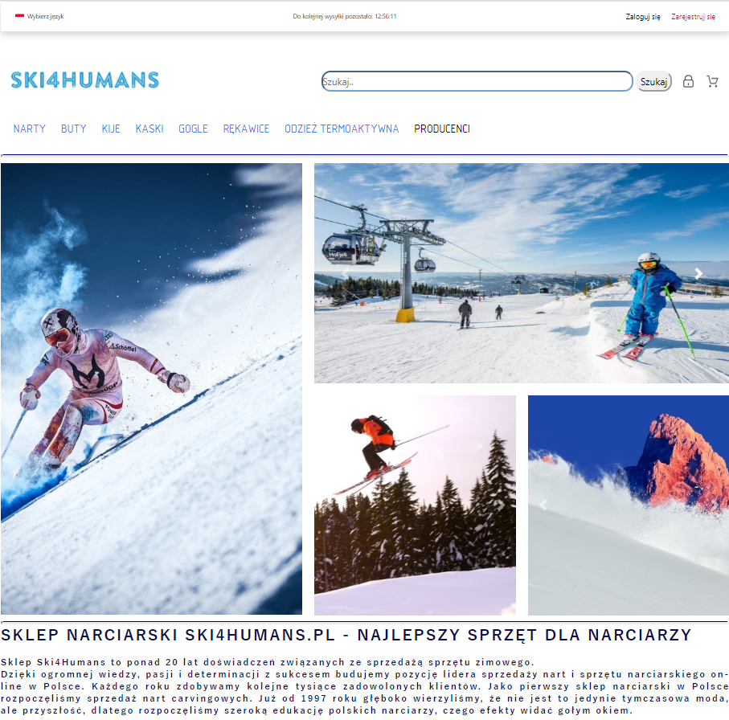

# Skii 4 humans - website
## 1 Introduction
_Website with accessories for skiing. This application was created to train JAVA backend, while the frontend was created in order to present the progress._
_It is not website for any existing shop_

## 2 Table of Contents
- [Introduction](#1-Introduction)
- [Table of Contents](#2-Table-of-Contents)
- [How to run ?](#3-how-to-run-)
- [Description of user pages and admin pages](#4-Description-of-user-pages-and-admin-pages)
  - [Homepage - for users](#41-Homepage-for-users)
  - [Homepage - for users](#41-Homepage-for-users)
  - [Homepage - for users](#41-Homepage-for-users)
  - [Homepage - for users](#41-Homepage-for-users)
- [TODO list](#5-TODO-list)

## 3 How to run ?

Download from this link: https://github.com/berNy92k/Ski4HumansWebApp_DB and run using for example tomcat with Intellij

or

use link from heroku: TODO

## 4 Description of user pages and admin pages
Below you will be able to see short description with images for:

- user pages
- admin pages

### 4.1 Homepage - for users
Screens with homepage view for clients/ users.

##### 4.1.1  Homepage - select
User can choose the type of equipment and gender.

 *the type of equipment 
 - skis
 - ski boots
 - ski poles
 - ski goggles
 - ski gloves
 - thermoactive clothing
 - manufacturers
 
 *gender
 - For Men
 - For Women
 - For Childen

##### 4.1.2  Homepage - example after select type with gender - when equipments exist in DB

##### 4.1.2  Homepage - example after select type with gender - when equipments not exist in DB

##### 4.1.2  Homepage - example of manufacturers

##### 4.1.2  Homepage - example of search button

##### 4.1.2  Homepage - login page

##### 4.1.2  Homepage - register page

##### 4.1.2  Homepage - select

##### 4.1.2  Homepage - select

##### 4.1.2  Homepage - select

##### 4.1.2  Homepage - select

##### 4.1.2  Homepage - select

##### 4.1.2  Homepage - select

##### 4.1.2  Homepage - select

##### 4.1.2  Homepage - select

### 4.2 Homepage - for admins
Screens with homepage view for admins

##### 4.1.2  Homepage - login page
Before admin will be able to do anything it is necessary to login.

##### 4.1.2  Homepage - admin
User can choose the type of equipment/gender and other information important for administrators.

 *the type of equipment 
 - skis
 - ski boots
 - ski poles
 - ski goggles
 - ski gloves
 - thermoactive clothing
 - manufacturers
 - other information
   - users
   - category
   - clients
   - reviews
   - orders
 
 *gender
 - For Men
 - For Women
 - For Childen
 

## 5 TODO list
* **IMPORTANT.** Make refactoring of frontend code - right now there is a mess 
(i was mostly focused on backend during creating this application - frontend was done to see results).
It is necessary to update style.css and separate style code from .jsp files.
* Make refactoring of backend code - delete unused code and simplify what is possible.
